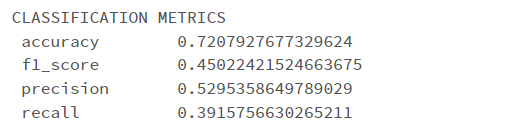

# PysparkMLlib
**ML pipeline for sentiment classification**
 
**S3(input data) --> ML Pipeline (Tokenizer, StopWordsRemover, Hasing, Encoding)--> Classification model --> output sentiment predictions --> S3 bucket**
 
S3 connection configuration: 
    
_    hadoop_conf = spark._jsc.hadoopConfiguration()
    hadoop_conf.set("fs.s3n.impl", "org.apache.hadoop.fs.s3native.NativeS3FileSystem")
    hadoop_conf.set("fs.s3n.awsAccessKeyId", '*************')
    hadoop_conf.set("fs.s3n.awsSecretAccessKey", '*********************************')
_   
 
Sample execution output :
  
 

